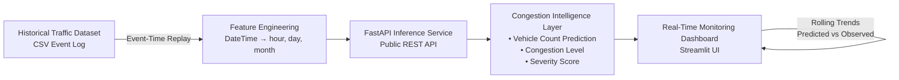

# Urban Mobility MLOps Platform  
### Bengaluru Traffic Case Study

**Real-Time Traffic Congestion Prediction & Monitoring Platform (Simulated Live Feed)**

Deployed API • Real-Time Dashboard • Production-Oriented MLOps Design

---

## Overview

This project is a **production-oriented MLOps platform** for predicting and monitoring **urban traffic congestion**. It demonstrates how city-scale mobility machine learning systems can be **designed, deployed, monitored, and iterated** in a real-world engineering environment.

The platform uses **historical Bengaluru traffic data** and **replays it as a simulated live event stream** to enable continuous inference, monitoring, and dashboarding. This mirrors how real-time ML systems are commonly developed and tested before integration with proprietary live sensor feeds.

> **Note:** This project does **not** consume real-time GPS or sensor data. The focus is on **system design, real-time inference behavior, and observability**, not live traffic control.

---

## Dataset

The dataset consists of timestamped traffic observations collected at multiple junctions in Bengaluru.

### Raw Schema
`DateTime, Junction, Vehicles, ID`

| Column | Description |
|--------|-------------|
| DateTime | Timestamp of observation |
| Junction | Junction identifier |
| Vehicles | Observed vehicle count (target variable) |
| ID | Unique record identifier |

### Feature Engineering

For modeling and inference, the following features are **derived from `DateTime`**:

| Derived Feature | Description |
|-----------------|-------------|
| hour | Hour of day (0–23) |
| day | Day of week (1–7) |
| month | Month of year (1–12) |

These derived features are used as **model inputs**, while `Vehicles` is used only for **evaluation and visualization**, not inference.

---

## Problem Statement

Urban traffic prediction systems face several operational challenges:

| Challenge | Platform Capability |
|-----------|---------------------|
| Non-stationary traffic patterns | Event-time–aware replay |
| Model performance degradation | Continuous inference |
| Offline-only ML pipelines | Real-time prediction API |
| Poor system observability | Live dashboard & trends |
| Difficult production deployment | Cloud-native services |

This project demonstrates how these challenges can be addressed using **modern MLOps and backend engineering practices**.

---

## System Architecture

The platform is designed as a **real-time traffic inference and monitoring system** driven by a **simulated live event stream** derived from historical data.


### System Flow

1. **Event Replay**  
   Historical traffic records are replayed in **event-time order** to simulate a live traffic stream.

2. **Feature Engineering**  
   Temporal features (`hour`, `day`, `month`) are derived dynamically from `DateTime`.

3. **FastAPI Inference Service**  
   A public REST API performs real-time inference on incoming traffic events.

4. **Congestion Intelligence**  
   Each event produces:
   - Predicted vehicle count  
   - Congestion level (LOW / MEDIUM / HIGH)  
   - Normalized severity score  

5. **Live Monitoring Dashboard**  
   A Streamlit-based UI visualizes:
   - Current traffic state  
   - Rolling prediction trends  
   - Predicted vs observed vehicle counts  

---

## Tech Stack

| Layer | Technology |
|-------|------------|
| ML Model | Random Forest Regressor |
| API | FastAPI |
| Frontend | Streamlit |
| Data Processing | Pandas |
| Backend Hosting | Hugging Face Spaces |
| Dashboard Hosting | Streamlit Cloud |
| Version Control | Git & GitHub |

---

## Live Demos

### FastAPI Inference Service

**Base URL:**  
`https://Sukumarbv-bengaluru-traffic-api.hf.space`

**Endpoint:**  
`POST /predict`

**Example Request:**
```json
{
  "hour": 8,
  "day": 1,
  "month": 1,
  "junction": 1
}
```

**Example Response:**
```json
{
  "predicted_vehicles": 45,
  "congestion_level": "MEDIUM",
  "severity_score": 0.65
}
```

### Real-Time Monitoring Dashboard

The Streamlit dashboard provides a simulated live view of traffic conditions by replaying historical events in real time.

**Dashboard URL:**  
`[Add your Streamlit dashboard URL here]`

#### Dashboard Capabilities

- Live traffic state visualization
- Congestion classification
- Rolling time-series plot (predicted vs observed)
- Recent event table
- Event-time–aware replay speed

---

## Key Design Decisions

### Event-Time Replay
Historical data is replayed using actual timestamp gaps to simulate real-time behavior.

### Derived Feature Pipeline
Temporal features are computed dynamically from timestamps, reflecting real production systems.

### Separation of Services
Backend inference and frontend monitoring are deployed independently.

### Explainability
Raw predictions are enriched with congestion labels and severity scores.

---

## Getting Started

### Prerequisites
- Python 3.8+
- pip or conda

### Installation
```bash
# Clone the repository
git clone https://github.com/SukumarBV/bengaluru-traffic-mlops.git
cd bengaluru-traffic-mlops

# Install dependencies
pip install -r requirements.txt
```

### Running Locally

#### Start FastAPI Service
```bash
uvicorn app.main:app --reload --port 8000
```

#### Start Streamlit Dashboard
```bash
streamlit run dashboard/app.py
```

---

## Project Structure
```
bengaluru-traffic-mlops/
├── app/
│   ├── main.py              # FastAPI application
│   ├── model.py             # ML model wrapper
│   └── utils.py             # Helper functions
├── dashboard/
│   └── app.py               # Streamlit dashboard
├── data/
│   └── traffic_data.csv     # Historical traffic data
├── models/
│   └── traffic_model.pkl    # Trained model
├── notebooks/
│   └── exploration.ipynb    # Data exploration
├── requirements.txt
└── README.md
```

---

## Author

**Sukumar BV**  
3rd Year AIML Student  
GitHub: [@SukumarBV](https://github.com/SukumarBV)

---

## Disclaimer

This project uses simulated live traffic streams derived from historical data. It does not consume real-time GPS, sensor, or commercial traffic feeds.

---

## Contributing

Contributions, issues, and suggestions are welcome! Feel free to:
- Open an issue for bug reports or feature requests
- Submit a pull request with improvements
- Share feedback on the project design
